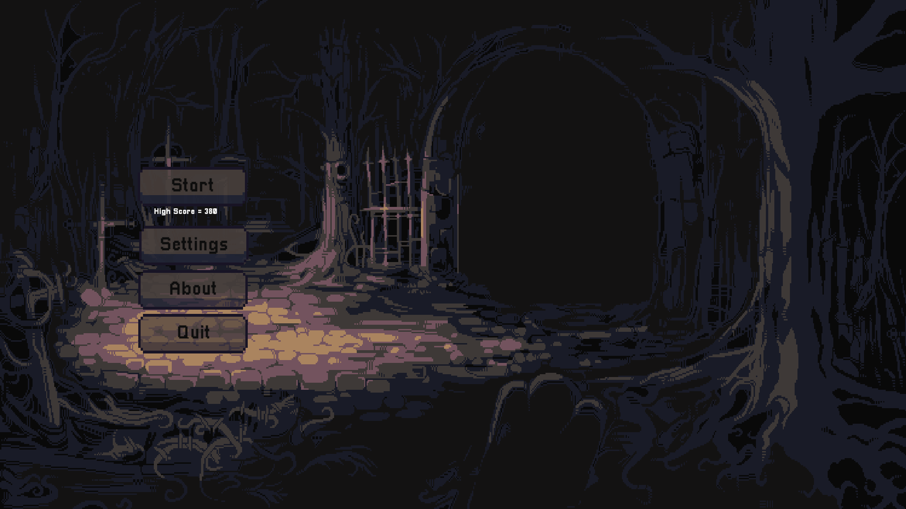
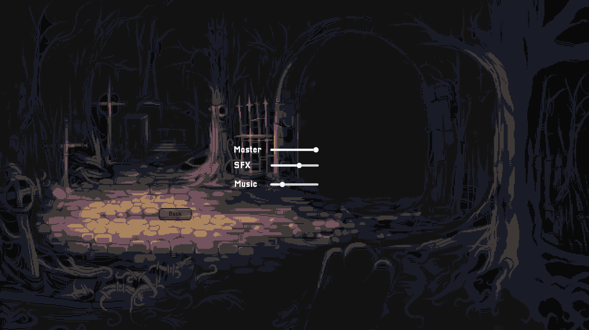
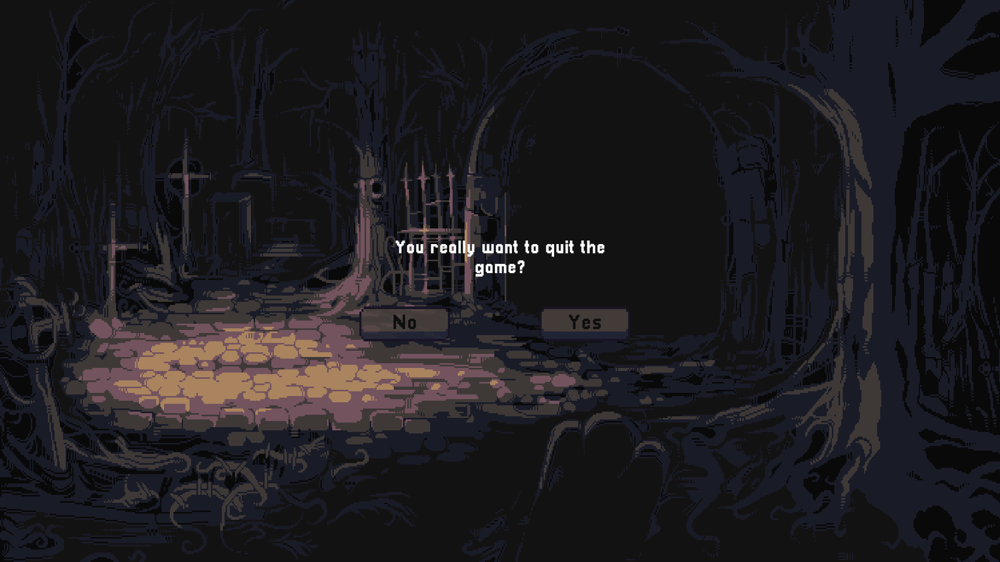
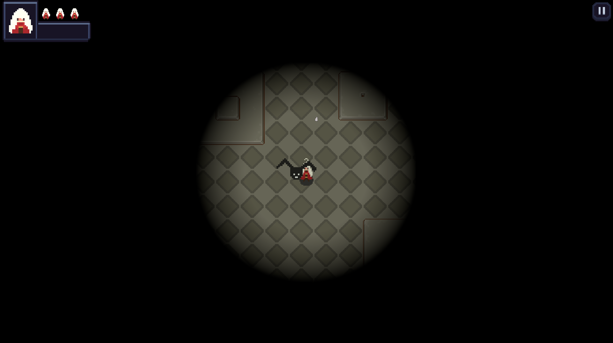
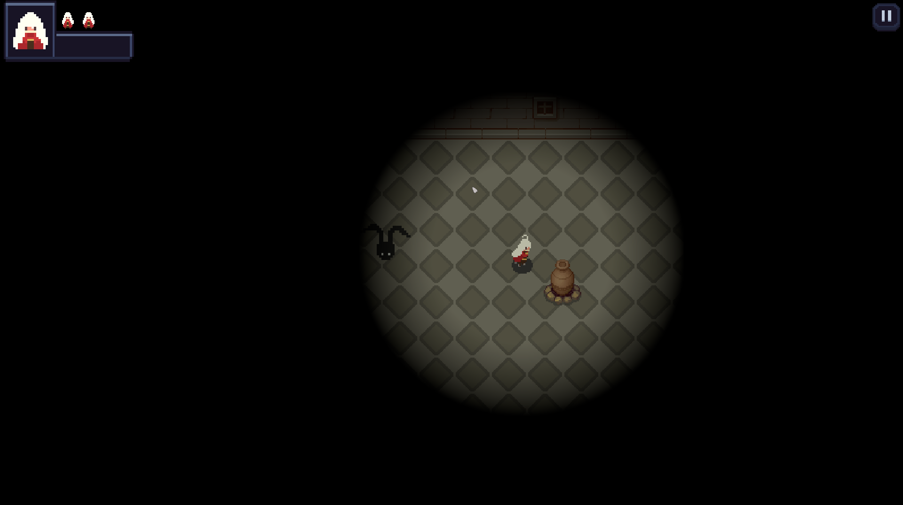
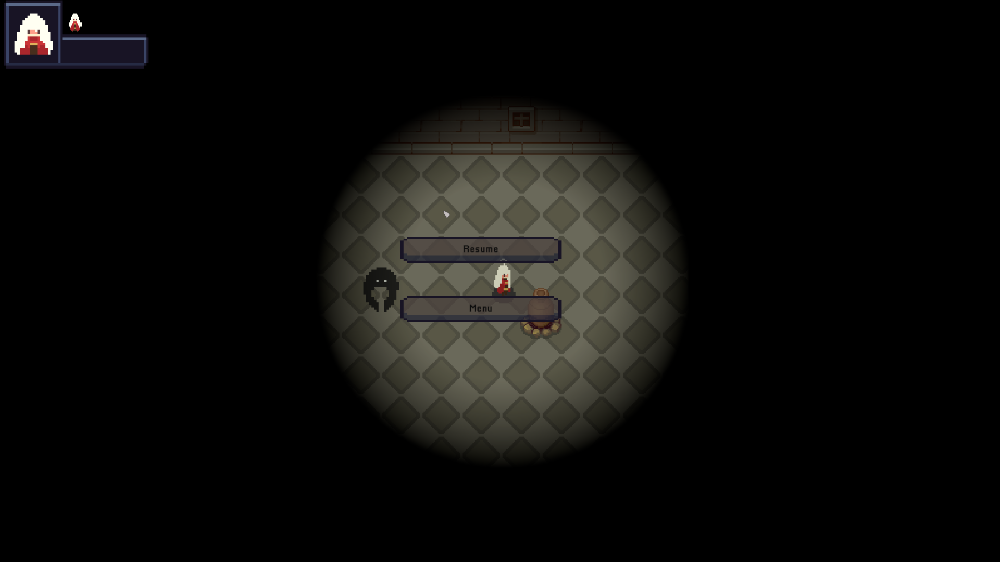

# Dead ends
##  Introduction 
Genre: Survival, Rougelite, Pixel graphics

Player
- WASD or arrow keys to move the player
- Space bar to dash

Enemy
- Chasing-bat: always tracking your location and chasing you
- Patrolling-bat: patrol around the map, attack you if you get in it's range

## Gameplay 
Thrown into a maze haunted by whispers, your only goal is to survive as long 
as possible. Randomly scattered throughout the shifting corridors, power-ups 
await: a health potion to mend your fraying nerves, a burst of speed to outrun 
spectral claws, or the chilling embrace of invisibility. Can you dance with 
death in this pixelated prison and escape the eternal fog?

## Mockups of the Game

MainMenu

Settings Screen

Quit Screen

In-game 1

In-game 2

Pausing Screen

## Game preview
https://youtu.be/Y4QsI7T5EkI